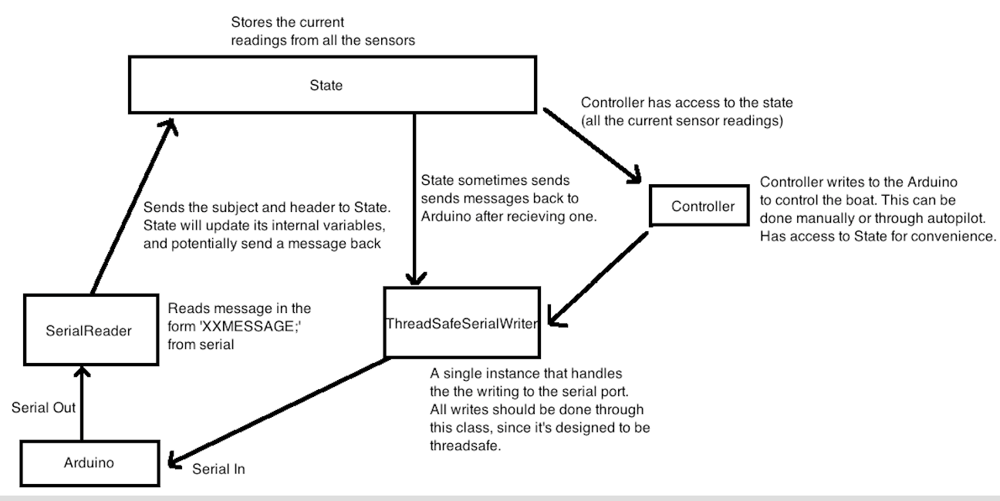

# Raspberry Pi Software

This file should contain documentation for the Raspberry Pi code.

## How to setup dev environment
_Add virtualenv instructions here_

## Class overview


#### rpi\_main.py - ThreadsafeSerialWriter
Writes to a serial port in a thread safe manner - if two threads try to write to the same port, then the messages will be send properly without getting jumbled together. There should ever only be one instance of this class per serial port. All objects that write to the same port should share the ThreadSafeSerialWriter instance. 

The `write` method takes a subject and message, and sends it to a serial port

#### rpi\_main.py - SerialReader
Reads a message of the form 'XXXMESSAGE;' from the serial port.

#### rpi\_main.py - State
Contains the state of the all the sensors. There should only ever be one instance of this.
        
A state has handlers, that handle a certain type of message. The handlers should be thought of as `reacting` to messages from the serial port, and should never be explicitly called. For instance, the `_handle_compass` method is called every time a message with subject CP is recieved, and it reacts by updating the `compass_angle` variable. Handlers should not be hugely complex. More complicated logic (autopilot, manual control) should be handled by the Controller, which can read from the State.


#### rpi\_main.py - Controller
Should eventually contain the majority of the autopilot control logic. This class has access to the State, and ThreadSafeSerialWriter. This can be implemented in a seperate thread than the reader, and the State object will be shared across threads.

## Bytes in Python
Unlike languages like C or C++, a Python `str` is not treated as an array of 8-bit bytes. Python has two built-in types for handling bytes - `bytes` and `bytearray`. This means that if someone wants to sent a string to python, one must convert into `bytes`. There are multiple ways to do this but for consistency, one should use the `encode()` method.

Ex. Converting string to bytes
```
my_string = "hello"
my_string_as_bytes = my_string.encode('utf-8')  # utf-8 is a standard way of encoding text into bytes.
```

Ex. Converting numbers to bytes
```
my_num = 123

# Convert my num to a string, then convert it to a byte
my_num_as_bytes = str(my_num).encode('utf-8')
```

If you ever have a string literal, you can use the `b` prefix, which will encode to ascii by default (which utf-8 is backwards compatible with.)

```
my_byte_message_1 = b"hello"  # Preferred
my_byte_message_2 = "hello".encode('utf-8')  # Also valid, but more tedious to write.
```
